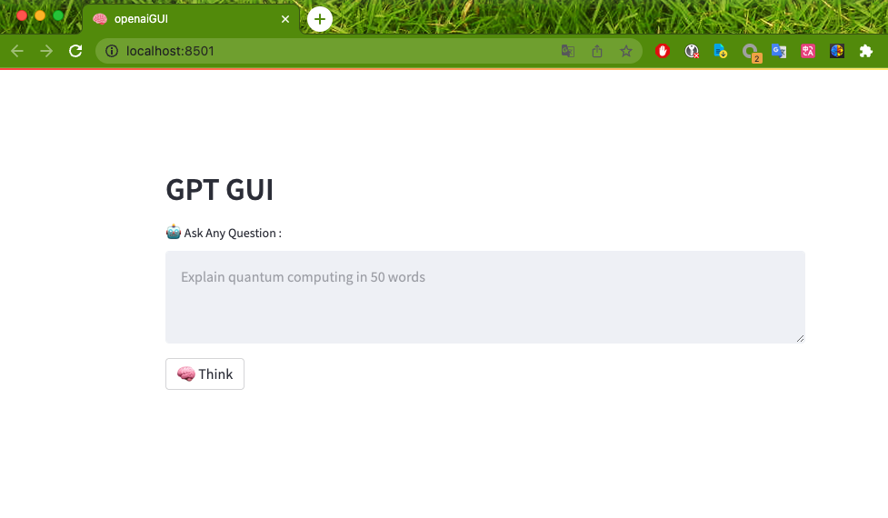

# openai-rev-webui



## how to use
1. login [chatgpt](https://chat.openai.com/)

2. access[chatgpt-session](https://chat.openai.com/api/auth/session)， get your **accessToken**

3. Create a virtual environment:
```shell
python -m venv venv
```

4. Activate the virtual environment:
```shell
# For Linux or macOS:
source venv/bin/activate

# For Windows:
venv\Scripts\activate
```

5. Install the dependencies using `requirements.txt` file:
```shell
pip install -r requirements.txt
```
6. 设置环境变量
```shell
cp .env.example .env
```

7. replace "YOUR_TOKEN" to your "accessToken"

8. 
```shell
pip install -r requirement.txt
```

9. 
```shell
streamlit run streamlit_app.py
```

## Credits
- [ChatGPT](https://chat.openai.com/chat) from [OpenAI](https://openai.com)

## License
This project is released under the terms of the GPL 2.0 license. For more information, see the [LICENSE](LICENSE) file included in the repository.